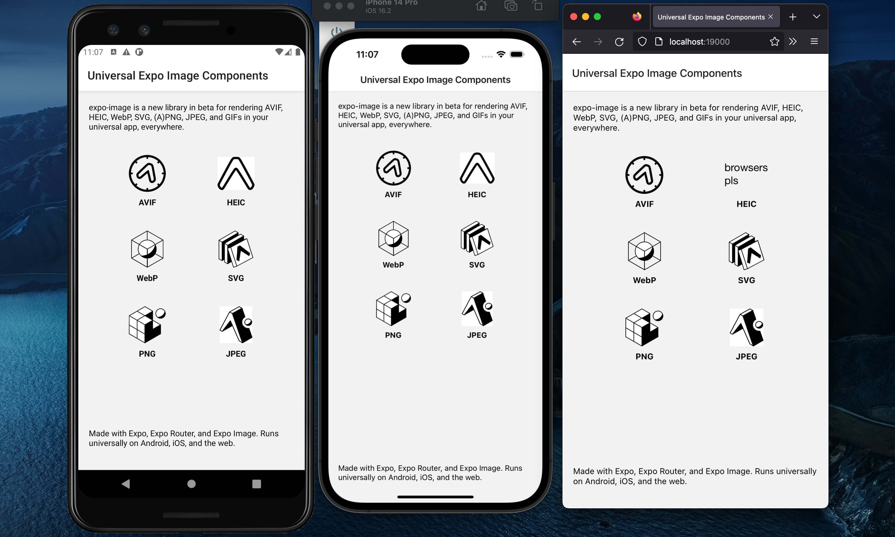

# An expo-image demo

This is a sample app that demos the [`expo-image`](https://docs.expo.dev/versions/latest/sdk/image/) component along with `expo-router`. `expo-image` is currently in beta.

The app displays JPEG, PNG, SVG, WebP, HEIC, and AVIF images. `expo-image` can also display formats like GIF, ICO, and Animated PNG.

## Running this app

Clone this repository. Install the dependencies with Yarn. Run `yarn start android`, `yarn start ios`, or `yarn start web`.

Developed on macOS with Node 18, Yarn v1, Java 11, and Xcode 14.2.
